# Esche.rb
## Amsterdam.rb
## 17 April

---

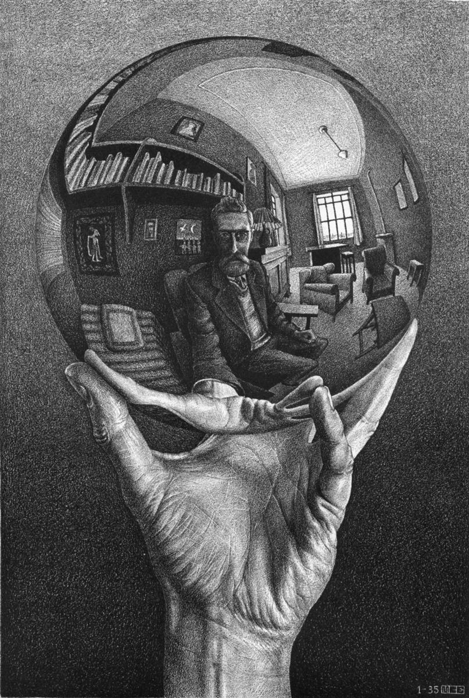

???

* Maurits Cornelis Escher
* 17 June 1898 – 27 March 1972

---

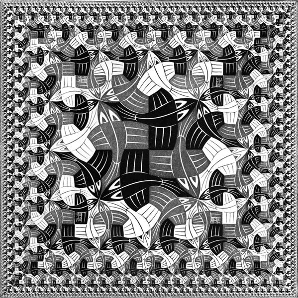

???

* Square Limit
* 1964

---

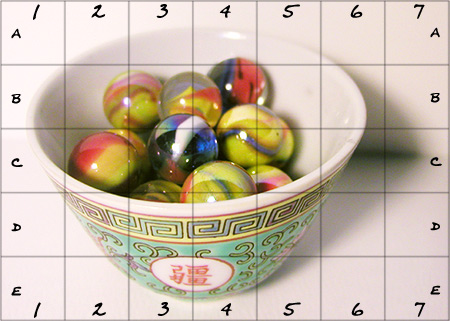

???

* Grid Method
* Transform Grid

---

.geometry[
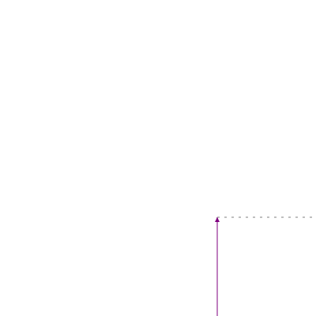]

--

```ruby
Box = Struct.new(:a, :b, :c)
```

---

.geometry[
]

???

* No symmetries. d, b, p, q all different

---

.geometry[
]

???

* Turn

---

.geometry[
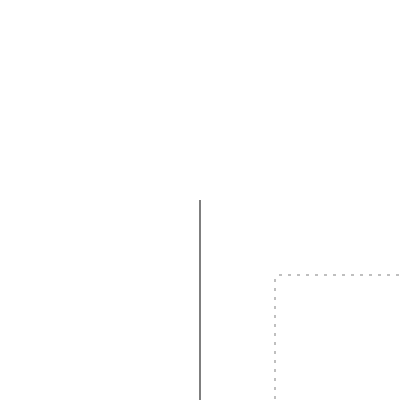]

.small.geometry[
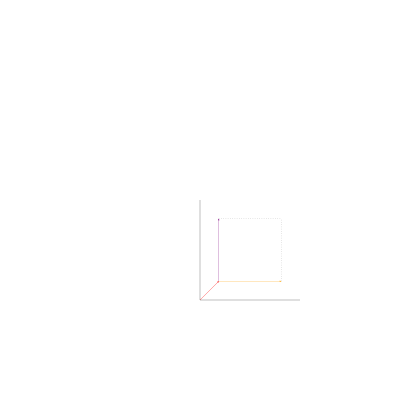]

???

* Turn the box
* How?

--

```ruby
def turn_box(box)
  Box.new(
    add(box.a, box.b),
    box.c,
    neg(box.b)
  )
end
```

---

.geometry[
]

???

* Flip

---

.geometry[
]

.small.geometry[
]


???

* Flip the box
* How?

--

```ruby
def flip_box(box)
  Box.new(
    add(box.a, box.b),
    neg(box.b),
    box.c
  )
end
```

---

.geometry[
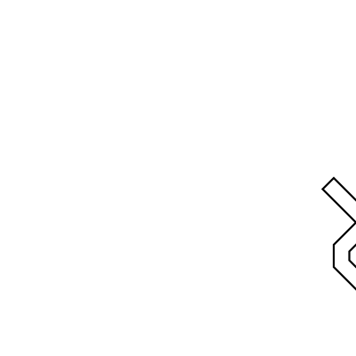]

???

* Toss

---

.geometry[
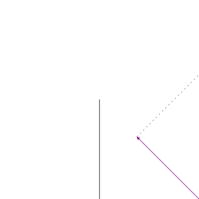]

.small.geometry[
]

???

* Toss the box
* How?

--

```ruby
def toss_box(box)
  Box.new(
    add(box.a, scale(0.5, add(box.b, box.c))),
    scale(0.5, add(box.b, box.c)),
    scale(0.5, sub(box.c, box.b))
  )
end
```

---

.geometry[
]

---

.geometry[
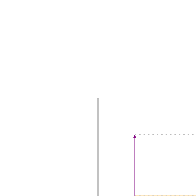]

.small.geometry[
]

---

.geometry[
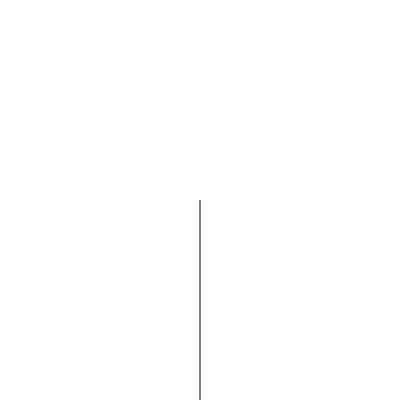]

.small.geometry[
]


---

.geometry[
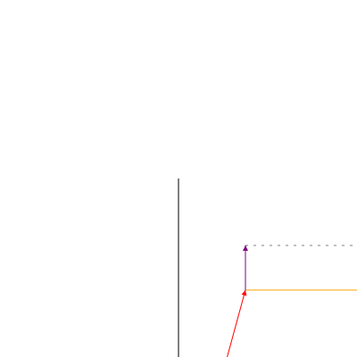]

.small.geometry[
]

---

.geometry[
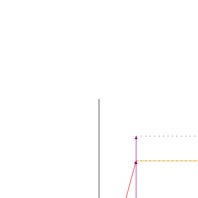]

.small.geometry[
]

---

.geometry[
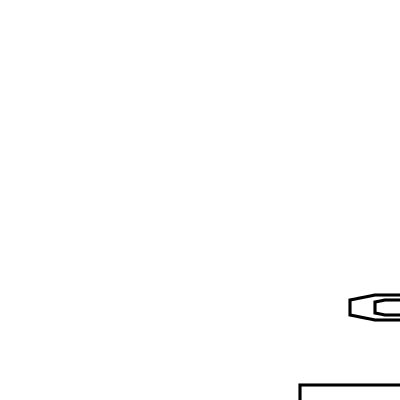]

--

```elm
Picture : Box -> List Shape
```

???

* Little white lie
* Picture : Box -> List (Shape, Style)

---

```ruby
def above_ratio(m, n, pm, pn)
  lambda { |box|
    factor = m.to_f() / (m + n).to_f()
    boxm, boxn = split_vertically(factor, box)
    pm.(boxm) + pn.(boxn)
  }
end
```

---

.geometry[
]

--

```ruby
def beside (pm, pn)
  beside_ratio(1, 1, pm, pn)
end
```

---

.geometry[
]

--

```ruby
def quartet(nw, ne, sw, se)
  above(beside(nw, ne), beside(sw, se))
end
```

---

.geometry[
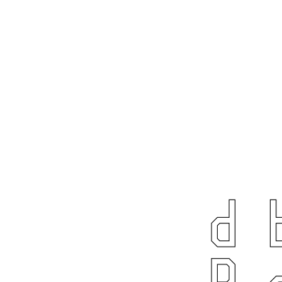]


---

```ruby
def row(w, m, e)
  beside_ratio(1, 2, w, beside(m, e))
end

def column(n, m, s)
  above_ratio(1, 2, n, above(m, s))
end

def nonet(nw, nm, ne, mw, mm, me, sw, sm, se)
  column(row(nw, nm, ne), row(mw, mm, me), row(sw, sm, se))
end
```

---

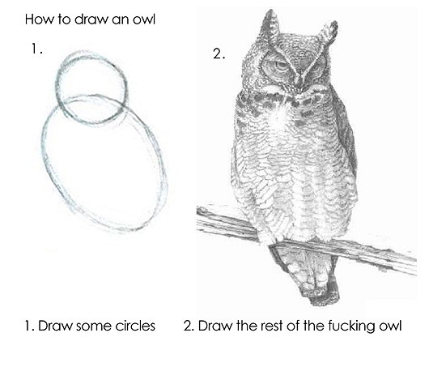

---

.geometry[
]

---

.geometry[
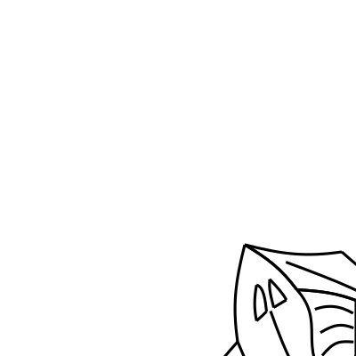]

--

```ruby

def over(p, q)
  lambda { |box|
    p.(box) + q.(box)
  }
end
```

???

* Remember `Picture : Box -> List Shape`


---

.geometry[
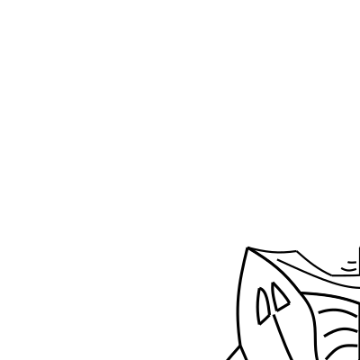]

--

```ruby
def ttile(p)
  f = flip(toss(p))
  over(p, over(f,turn(turn(turn(f)))))
end
```

---

.geometry[
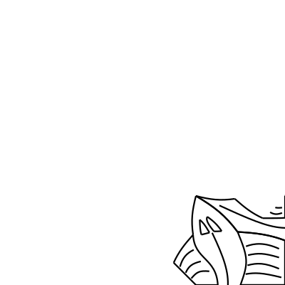]

--

```ruby
def utile(p)
  f = flip(toss(p))
  g = over(f, turn(f))
  over(g, turn(turn(g)))
end
```

---

.geometry[
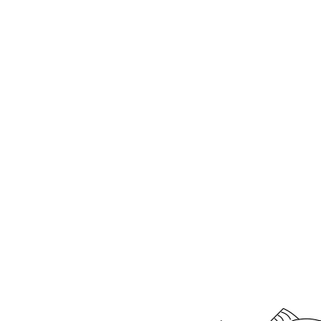]

---

.geometry[
]

---

.geometry[
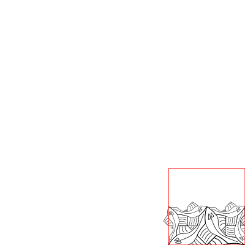]

---

```ruby
def side(n, p)
  if n == 0 then
    blank()
  else
    se = ttile(p)
    sw = turn(se)
    ne = side(n - 1, p)
    nw = ne

    quartet(nw, ne, sw, se)
  end
end
```

---

.geometry[
]

---

.geometry[
]

---

```ruby
def corner(n, p)
  if n == 0 then
    blank()
  else
    nw = corner(n - 1, p)
    ne = side(n - 1, p)
    sw = turn(ne)
    se = utile(p)

    quartet(nw, ne, sw, se)
  end
end
```

---

.geometry[
]

---

```ruby
def square_limit(n, p)
  if n == 0 then
    blank()
  else
    nm = side(n - 1, p)
    mw = turn(nm)
    sm = turn(mw)
    me = turn(sm)

    nw = corner(n - 1, p)
    sw = turn(nw)
    se = turn(sw)
    ne = turn(se)

    mm = utile(p)

    nonet(nw, nm, ne, mw, mm, me, sw, sm, se)
  end
end
```

---

## Attributions

* Hand with reflecting sphere: [https://www.wikiart.org](https://www.wikiart.org/en/Search/hand%20with%20reflecting%20sphere)
* Grid Method: [https://www.art-is-fun.com](https://www.art-is-fun.com/grid-method)
* Escher in Elm: [https://github.com/einarwh/escher-workshop](https://github.com/einarwh/escher-workshop)
* Functional Geometry: [https://eprints.soton.ac.uk/257577/1/funcgeo2.pdf](https://eprints.soton.ac.uk/257577/1/funcgeo2.pdf)
* Code and Presentation: [https://github.com/fifth-postulate/esche.rb](https://github.com/fifth-postulate/esche.rb)
