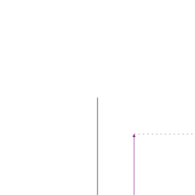

# Esche.rb
## Amsterdam.rb
## 17 April

---


???

* Maurits Cornelis Escher
* 17 June 1898 – 27 March 1972

---


???

* Square Limit
* 1964

---


???

* Grid Method
* Transform Grid

---

.geometry[
]

--

```ruby
Box = Struct.new(:a, :b, :c)
```

---

.geometry[
]

???

* No symmetries. d, b, p, q all different

---

.geometry[
]

???

* Turn

---

.geometry[
]

???

* Turn the box
* How?

--

```ruby
def turn_box(box)
  Box.new(
    add(box.a, box.b),
    box.c,
    neg(box.b)
  )
end
```

---

.geometry[
]

---

.geometry[
]

---

.geometry[
]

---

.geometry[
]

---

.geometry[
]

---

.geometry[
]

---

.geometry[
]

---

.geometry[
]

---

.geometry[
]

---

.geometry[
]

---

.geometry[
]

---

.geometry[
]

---

## Attributions

* Hand with reflecting sphere: [https://www.wikiart.org](https://www.wikiart.org/en/Search/hand%20with%20reflecting%20sphere)
* Grid Method: [https://www.art-is-fun.com](https://www.art-is-fun.com/grid-method)
* Escher in Elm: [https://github.com/einarwh/escher-workshop](https://github.com/einarwh/escher-workshop)
* Functional Geometry: [https://eprints.soton.ac.uk/257577/1/funcgeo2.pdf](https://eprints.soton.ac.uk/257577/1/funcgeo2.pdf)
